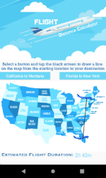
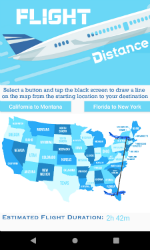

# CS441 FLIGHT DISTANCE CALCULATOR ANDROID APP

## Functionality

Implements a custom graphing widget on SurfaceView that allows the user to draw a line from a starting point to a destination, emulating the flight path of an airplane. Once the user reaches the destination with their drawn line, the estimated flight duration will appear as a time in the format 'Xh YYm'. Two buttons are provided to allow the user to choose their respective starting point and destination, in this app being 'California to Montana' and 'Florida to New York'. Coordinates were figured out based on the SurfaceView's grid, starting with (0,0) from the top-left corner, to accurately depict the total time traveled when the line crossed the destination city. A pinch-to-zoom feature is also provided to allow the user to zoom in on the header image. My idea for this project came from my love of traveling. When my family is deciding on a new place to visit, we always check the flight distance and consider it as one of the factors to whether we pick that destination or not. Prof. Madden's android surface app tutorial helped me a great deal to start my own code. From there I worked at it every day, reading up on SurfaceView, and figuring out and planning what I could do with the app, such as deciding between spinner or button functionality, adding an image to the surfaceView background, and plotting the correct coordinates so that the amount of time traveled will only print to the screen when the user's line crosses it. 

## Design Features

This app contains:
- 1x SurfaceView
- 6x LinearLayout (4 horizontal, 2 vertical)
- 5x Drawable Custom Images
- 3x ImageView
- 1x TextView
- 2x Button

## Preview

